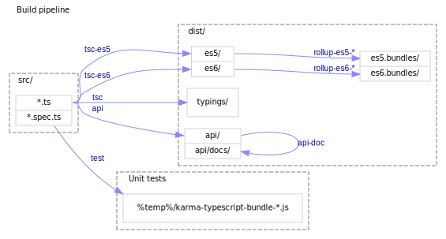

# Making a build

<a name="toolchain"></a>
## Prepare a toolchain

The library uses a following toolchain:
* [Node JS](https://nodejs.org) with NPM (NodeJS Package Manager).
* [yarn](https://yarnpkg.com) Package Manager.
* [npx](https://www.npmjs.com/package/npx) NPM Package Executor
* [@microsoft/api-extractor](https://api-extractor.com/pages/overview/intro/) to extract API type information and comments
* [@microsoft/api-documenter](https://api-extractor.com/pages/setup/generating_docs/) to build API documentation from API type information and comments extracted by the `api-extractor`.

First install NodeJS with NPM, then install the rest of the toolchain globally using NPM:

```
npm install -g yarn npx @microsoft/api-extractor @microsoft/api-documenter
```

<a name="clone"></a>
## Cloning a repository

To clone a repository:

```
git clone https://github.com/hidglobal/digitalpersona-core.git
```

<a name="deps"></a>
## Installing dependencies


To get started with the library, install dependencies first:

```
cd ./digitalpersona-core
yarn
```

<a name="code"></a>
## Build code

Build the library:

```
npm run build
```

or open the library in VS Code ad press `Ctrl+Shift+B`.

The build output (JavaScript files) will be put into following locations, according to a target:
* ES6 (for modern browsers):
  * unbundled: `./dist/es6/`
  * bundled (UMD): `./dist/es6.bundles/`
* ES5 (for older browsers):
  * unbundled: `./dist/es5/`
  * bundled: `./dist/es5.bundles/`
* TypeScript typings: `./dist/typings/`

<a name="documentation"></a>
## Build documentation

API documentation is built from source code comments in a TSDoc format
using `@microsoft/api-extractor` and `@microsoft/api-documenter`.

To build API documentation run:
```
npm run api-doc
```

The build output (API report files and Markdown documents) will be put into a `./dist/api/` folder.

## Build pipeline overview


[](build-pipeline.dot)

> NOTE: this diagram is created using Graphviz and a `build-pipeline.dot` file.
Do not edit the SVG file directly.
In VS Code, use [Graphviz Preview](https://marketplace.visualstudio.com/items?itemName=EFanZh.graphviz-preview)
extension to preview DOT files and export them to SVG/PNG/PDF.
